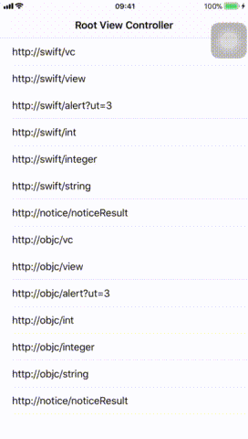
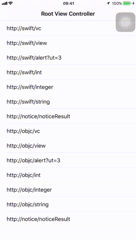

# Routable

[](https://travis-ci.org/bigL055/Routable)
[](http://cocoapods.org/pods/Routable)
[](http://cocoapods.org/pods/Routable)
[](http://cocoapods.org/pods/Routable)

## Example




## 简介

Routable是采用swift编写的 Target-Action形式的路由框架.参考自:[casa: iOS应用架构谈 组件化方案](https://casatwy.com/iOS-Modulization.html)

## 使用

- 使用CocoaPods安装

  ```
  pod "SPRoutable"
  ```

- 导入

  - swift

    ```swift
    import SPRoutable
    ```

  - objc

    ```objective-c
    #import<SPRoutable/Routable.h>
    ```

- 注意
  -  建立目标类用于接受Routable调用

     - 目标类为swift,且存在于Frameworks中,则需要在头部添加@objc(类名)

     - 目标类只会init一次,除非手动清除

     - 类名与函数名具有默认前缀(可自行配置)


 - swift示例:

      - 目标类

      ```swift
      @objc(Router_swift)
      public class Router_swift: NSObject {

      @objc func router_vc(params:[String: Any]) -> UIViewController {
        let vc = SwiftViewController()
        vc.title = #function
        return vc
      }

      @objc func router_view(params:[String: Any]) -> UIView {
        let view = UIView()
        view.frame = CGRect(x: 0, y: 0, width: UIScreen.main.bounds.width, height: 20)
        return view
      }

      @objc func router_alert(params: [String: Any] = [:]) {
        let alert = UIAlertController()
        alert.title = #function
        alert.message = params.description
        let action = UIAlertAction(title: "确定",
                                   style: UIAlertActionStyle.cancel,
                                   handler: nil)
        alert.addAction(action)
        UIApplication.shared.keyWindow?.rootViewController?.present(alert, animated: true, completion: nil)
      }

      @objc func router_int(params: [String: Any] = [:]) -> Int {
        return arc4random_uniform(UInt32.max).hashValue
      }

      @objc func router_integer(params: [String: Any] = [:]) -> NSInteger {
        let int = NSInteger(bitPattern: UInt(arc4random_uniform(UInt32.max)))
        return int
      }

      @objc func router_string(params: [String: Any] = [:]) -> String {
        return #function
      }

      @objc func router_noticeResult() {
        router_alert(params: ["notice": #function])
      }
      ```
      - 调用目标类函数

      ```swift
      get viewController:
      guard let vc = Routable.viewController(url: "http://swift/vc") else { return }
        	
      get view:
      guard let v = Routable.view(url: "http://swift/view") else { return }

      get int:
      guard let v: UIView = Routable.object(url: "http://swift/int") as Int? else { return }

      get function:
      Routable.executing(url: "http://swift/alert?ut=3")

      //广播
      send noice:
      Routable.noice(url:"http://notice/noticeResult")
      ```


- 路由配置参数配置:

  ```swift
  Routable.classPrefix = "Router_"  // 类名前缀 	 defalut: "Router_"
  Routable.funcPrefix  = "router_"  // 函数前缀	 defalut: "router_"
  Routable.paramName   = "Params"   // 函数参数前缀 defalut: "Params"
  Routable.scheme	     = "scheme"   // 协议头	  defalut: ""
  ```

## Author

linhey, linhan.linhey@outlook.com

## License

Routable is available under the MIT license. See the LICENSE file for more info.
